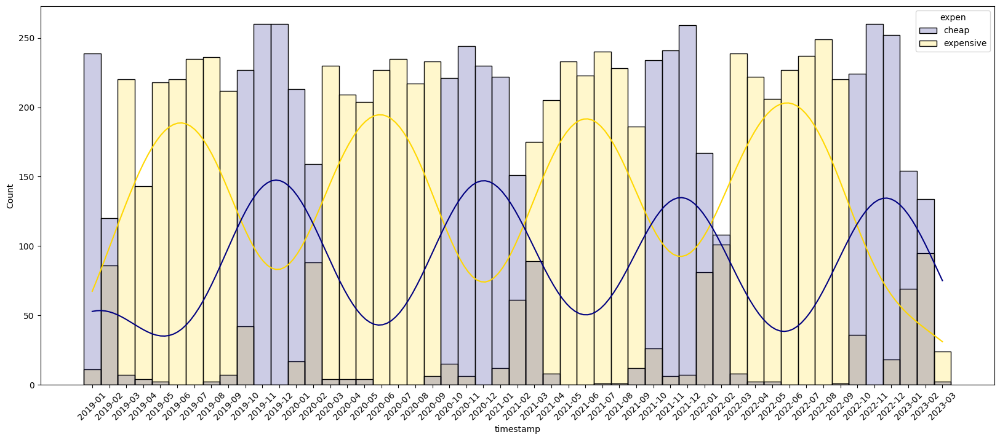
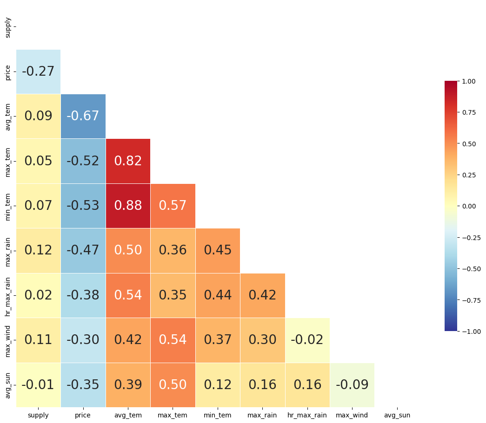
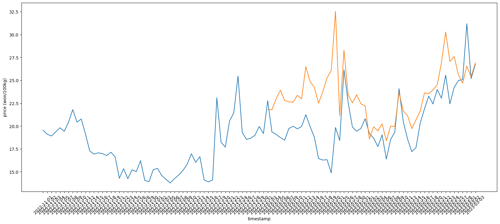

# 🌴 제주도 특산품의 가격과 연관 변수간 상관관계 분석

**제주도 특산품의 가격과 기상 변수 간의 상관관계를 분석하고, 가격 예측 모델을 구축한 프로젝트입니다.**  
특히, 감귤의 가격 분포가 혼합 분포(GMM)로 나타난 점과 기상 데이터를 활용한 Random Forest 모델링이 핵심입니다.

> 📊 **프로젝트 구성:** 데이터 수집, 상관관계 분석, 예측 모델링, 결과 시각화

---

## 📋 데이터 출처
- [Dacon](https://dacon.io/competitions/official/236176/data)
- [기상청 API](https://data.kma.go.kr/)

---

## 🔍 주요 분석
> ### 🍊 감귤의 혼합 분포 분석
> 
> - **핵심 내용:** 감귤의 가격이 두 가지 분포를 나타내 GMM을 통해 클러스터링을 수행.  
> - **결과:** 만감류와 노지감귤로 분류 가능.

---

> ### 🌦️ 기상 데이터와 가격의 상관관계 분석
> 
> - **핵심 내용:** 기온, 강수량 등 기상 변수가 가격에 미치는 영향을 분석.  
> - **결과:** 평균 기온과 가격 간 유의미한 음의 상관관계.

---

> ### 🌳 Random Forest를 활용한 가격 예측
> 
> - **핵심 내용:** 기상 데이터를 기반으로 Random Forest Regressor를 사용해 가격 예측 모델 생성.  
> - **결과:** RMSE 약 650, R² 약 0.93의 성능.

---

## 🛠 사용된 기술 스택
- **백엔드:** Python
- **모델:** GMM (Gaussian Mixture Model), Random Forest

---

## 📄 참고자료
- [PPT 자료](./ppt.pdf)
- **참고 링크:**
  - [Dacon 대회 페이지](https://dacon.io/competitions/official/236176/data)
  - [기상청 API](https://data.kma.go.kr/)

---

## ❓ 문의사항
**Issue**로 남겨주세요! 🙌
